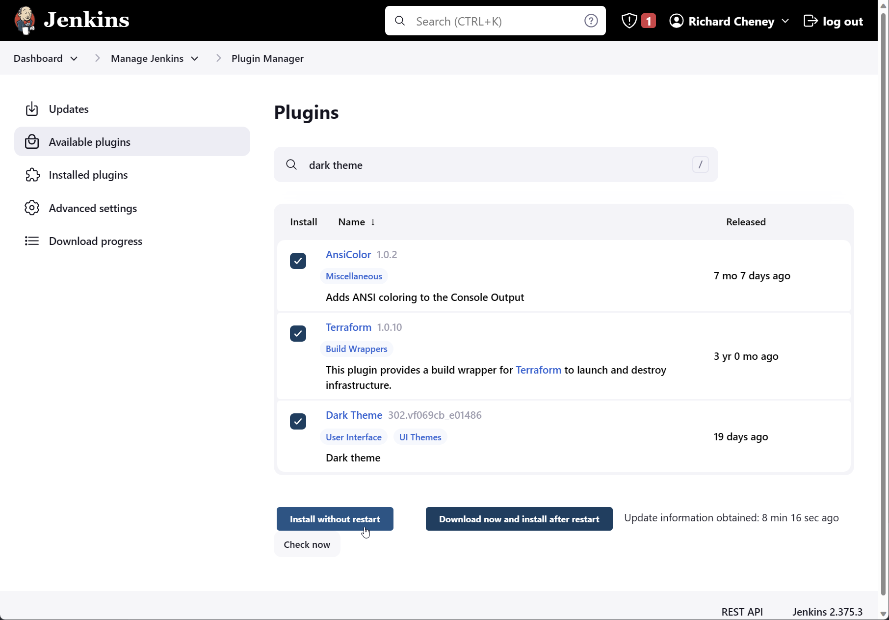

# Jenkins on Azure VM deploying Terraform config

Jenkins is a popular CI/CD tool. This example shows the creation of a Jenkins server with a service principal and both Azure CLI and Terraform installed.

Currently using credentials and secrets in Jenkins. Later will update with Azure Key Vault integration.

Assumes a Bash environment with the [Azure CLI](https://learn.microsoft.com/cli/azure/install-azure-cli), plus access to a valid subscription.

## Deploy a Jenkins server

1. Create cloud-config.yaml

    Create a cloud-config.yaml file with the following contents.

    ```yaml
    #cloud-config
    package_upgrade: true
    runcmd:
      - sudo apt install openjdk-11-jre ca-certificates curl apt-transport-https lsb-release gnupg gpg wget -y
      - wget -qO - https://pkg.jenkins.io/debian-stable/jenkins.io.key | sudo apt-key add -
      - wget -qO- https://apt.releases.hashicorp.com/gpg | gpg --dearmor | sudo tee /usr/share/keyrings/hashicorp-archive-keyring.gpg > /dev/null
      - wget -qO- https://packages.microsoft.com/keys/microsoft.asc | gpg --dearmor | sudo tee /usr/share/keyrings/microsoft.gpg > /dev/null
      - sh -c 'echo deb https://pkg.jenkins.io/debian-stable binary/ > /etc/apt/sources.list.d/jenkins.list'
      - sh -c 'echo "deb [arch=`dpkg --print-architecture` signed-by=/usr/share/keyrings/hashicorp-archive-keyring.gpg] https://apt.releases.hashicorp.com `lsb_release -cs` main" | sudo tee /etc/apt/sources.list.d/hashicorp.list'
      - sh -c 'echo "deb [arch=`dpkg --print-architecture` signed-by=/usr/share/keyrings/microsoft.gpg] https://packages.microsoft.com/repos/azure-cli/ `lsb_release -cs` main" | sudo tee /etc/apt/sources.list.d/azure-cli.list'
      - sudo chmod go+r /usr/share/keyrings/hashicorp-archive-keyring.gpg /usr/share/keyrings/microsoft.gpg
      - sudo apt-get update && sudo apt-get install jenkins terraform azure-cli jq -y
      - sudo service jenkins restart
    ```

    The cloud-config.yaml file will install

    * jenkins
    * terraform
    * azure-cli
    * jq

1. Set your default region and resource group

    Set these to your preferred values.

    ```bash
    az config set defaults.location=uksouth defaults.group=jenkins
    ```

    Setting defaults removes the need to specify `--location` and `--resource-group` on Azure CLI commands. Defaults are stored in `~/.azure/config`. Use `az config unset defaults.location defaults.group` to unset.

    See <https://learn.microsoft.com/cli/azure/azure-cli-configuration> for more.

1. Create the resource group

    ```bash
    az group create --name $(az config get defaults.group --query value -otsv)
    ```

1. Create the VM

    ```bash
    az vm create --name jenkins \
    --image UbuntuLTS \
    --admin-username "azureuser" \
    --generate-ssh-keys \
    --public-ip-sku Standard \
    --custom-data cloud-init-jenkins-terraform-azurecli.txt \
    --assign-identity [system]
    ```

1. Open port 8080 and 8443 on the NSG

    ```bash
    az vm open-port --port 8080 --priority 1010 --name jenkins
    az vm open-port --port 8443 --priority 1020 --name jenkins
    ```

## SSH to your Jenkins server

1. Grab the public IP address

    ```bash
    publicIp=$(az vm show --name jenkins  --show-details --query publicIps --output tsv)
    echo $publicIp
    ```

1. SSH onto the Jenkins server

    ```bash
    ssh azureuser@$publicIp
    ```

## Initial server config

1. Checks

    ```bash
    terraform --version
    az version
    service jenkins status
    ```

1. Display the Jenkins URL and unlock password

    ```bash
    publicIp=$(curl -sSL -H Metadata:true --noproxy "*" http://169.254.169.254/metadata/loadbalancer?api-version=2020-10-01 \
      | jq -r .loadbalancer.publicIpAddresses[0].frontendIpAddress)
    pwdfile=/var/lib/jenkins/secrets/initialAdminPassword
    echo "Open http://${publicIp}:8080"
    sudo --user=jenkins -- test -s $pwdfile && echo "and paste in $(sudo cat $pwdfile)"
    ```

## Initial UI connection

1. Connect to the URL and paste in the initialAdminPassword

1. Select initial plugins to install

    * GitHub

1. Create First Admin User

   * username
   * password
   * full name
   * email address

1. Save & Finish
1. Start using Jenkins

## Configure Jenkins Plugins

1. Manage Jenkins | System Configuration | Manage Plugins

    1. Click on *Available plugins*
    1. Search on the following plug-ins in turn
        * AnsiColor
        * Azure CLI
        * Azure Credentials
        * Azure Credentials Ext
        * Azure Key Vault
        * Terraform

    1. Check and *Install without restart*

        

    1. Scroll down and check *Restart Jenkins when installation is complete and no jobs are running*

    > You can also restart Jenkins using `http://<ip_address>:8080/restart` or `sudo service jenkins restart`.

## Jenkins Tools

Jenkins can install tools (binaries, etc) on the fly with automatic installers. We have installed Terraform manually via apt.

1. Manage Jenkins | Global Tool Configuration
1. Scroll down to the Terraform section
1. *Add Terraform*
    1. Name = **terraform**
    1. Install directory = **/usr/bin**
    1. Uncheck *Install automatically*

        
1. Save

## Credential

1. Create a service principal

    ```bash
    az ad sp create-for-rbac --name http://jenkins_terraform_sp --output jsonc
    ```

1. Get the service principal's object ID

    ```bash
    objectId=$(az ad sp list --filter "displayname eq 'http://jenkins_terraform_sp'" --query [0].id -otsv)
    ```

1. Create Owner RBAC role assignment on the subscription

    ```bash
    subscriptionId=/subscriptions/$(az account show --query id -otsv)
    az role assignment create --assignee $objectId --role "Contributor" --scope $subscriptionId
    ```

1. Display the subscription ID

    ```bash
    az account show --type id --output tsv
    ```

1. Recreate the service principal

    This will patch it, resetting the password.

    ```bash
    az ad sp create-for-rbac --name http://jenkins_terraform_sp --output jsonc
    ```

1. Manage Jenkins | Manage Credentials
1. Click on *System*
1. Click on *Global credentials*
1. *+ Add Credentials*
    * Kind = **Azure Service Principal**
    * **Subscription ID**
    * **Client ID** (appId)
    * **Client Secret** (password)
    * **Tenant ID**
    * Id = **jenkins_terraform_sp**
    * Description = **ht<span>tp://</span>jenkins_terraform_sp**
1. *Verify Service Principal*

    

1. *Create*

## Remote state

1. Create a storage account and container for the Terraform remote state

    ```bash
    rgId=$(az group show --name $(az config get defaults.group --query value -otsv) --query id -otsv)
    sa=terraform$(md5sum <<< $rgId | cut -c1-12)
    az storage account create --name $sa --sku Standard_LRS --allow-blob-public-access false
    az storage container create --name "tfstate" --account-name $sa --auth-mode login
    ```

    Uses md5sum to generate a predictable hash from the resource group's resource ID.

1. Add Storage Blob Data Contributor RBAC role assignment

    ```bash
    saId=$(az storage account show --name $sa --query id -otsv)
    az role assignment create --assignee $objectId --role "Storage Blob Data Contributor" --scope $saId
    ```

1. Display resource group name and storage account name

    ```bash
    az storage account show --name $sa --query "{resource_group:resourceGroup, storage_account:name}" --output yaml
    ```

1. Manage Jenkins | Manage Credentials
1. *System*, *Global credentials*, *+ Add Credentials*
1. Kind = **Secret text**

    Create two credentials, for **resource_group** and **storage_account**.

    

    These will be used later by `terraform init` for the backend.

## Next

On the next page you will use the Azure CLI and the Cloud Shell to pull down an image into the container registry and you'll also create a virtual network.

## Resources

* <https://learn.microsoft.com/azure/developer/jenkins/configure-on-linux-vm>
* <https://plugins.jenkins.io/azure-cli/>
* <https://plugins.jenkins.io/credentials/>
* <https://plugins.jenkins.io/azure-credentials/>
* <https://learn.microsoft.com/azure/developer/jenkins/deploy-to-azure-spring-apps-using-azure-cli>
* <https://github.com/Azure-Samples/jenkins-terraform-azure-example/blob/main/Create_Jenkins_Job.md>
* <https://github.com/Azure-Samples/azure-voting-app-redis>
* <https://registry.terraform.io/providers/hashicorp/azurerm/latest/docs/guides/managed_service_identity>
* <https://www.jenkins.io/doc/book/pipeline/jenkinsfile/>
* <https://www.genja.co.uk/blog/installing-jenkins-and-securing-the-traffic-with-tls-ssl/>
* <https://github.com/smertan/jenkins>
* <https://learn.microsoft.com/en-us/azure/load-balancer/howto-load-balancer-imds?tabs=linux>
* <https://learn.microsoft.com/en-us/azure/virtual-machines/instance-metadata-service?tabs=linux>
* <https://registry.terraform.io/providers/hashicorp/azurerm/latest/docs/guides/service_principal_client_secret>
