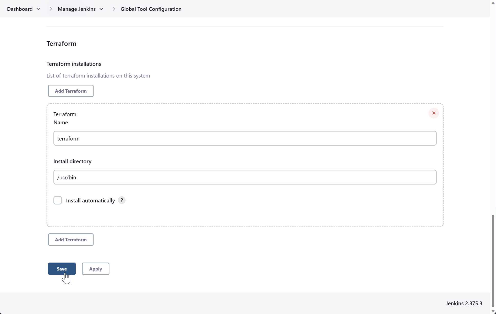
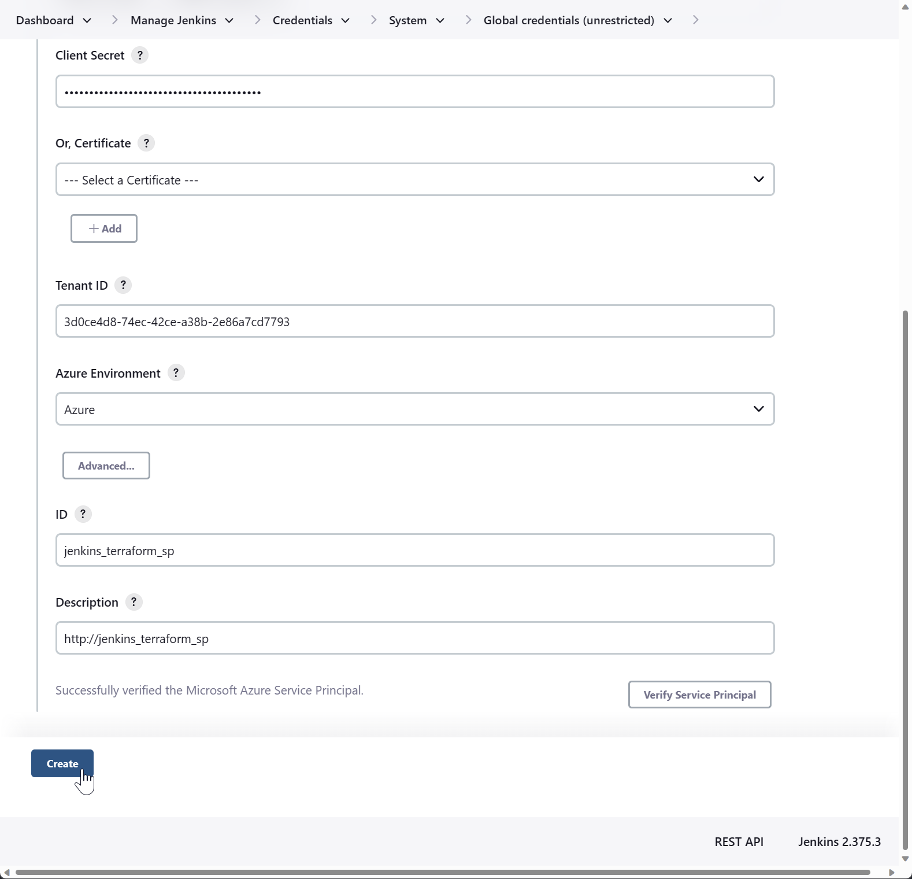
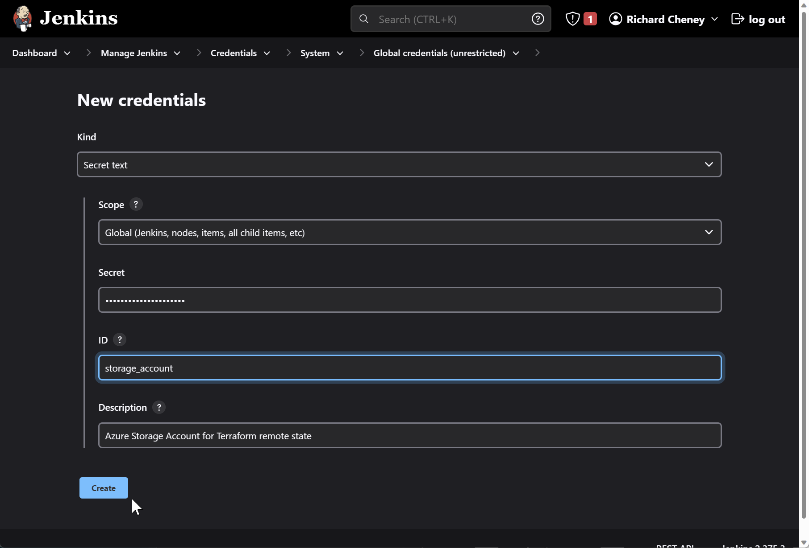
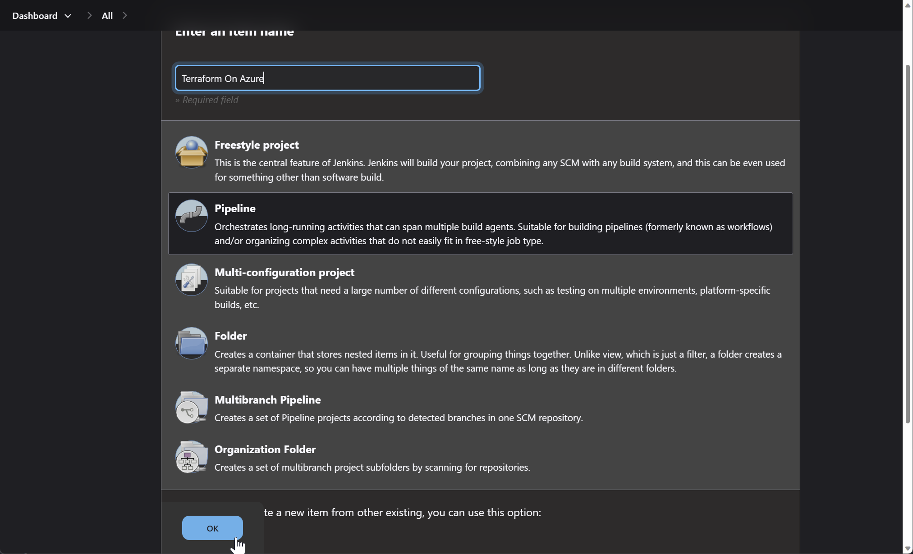
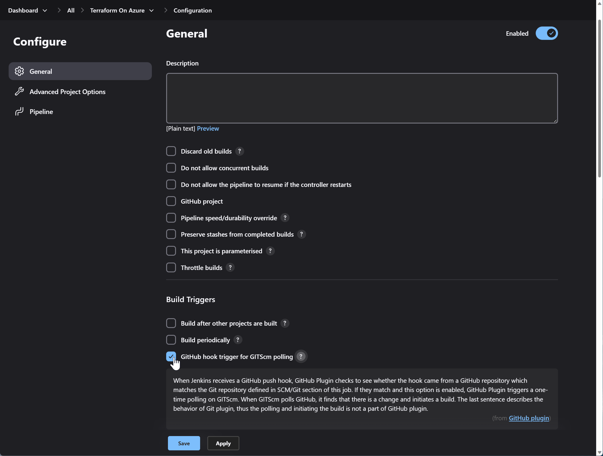
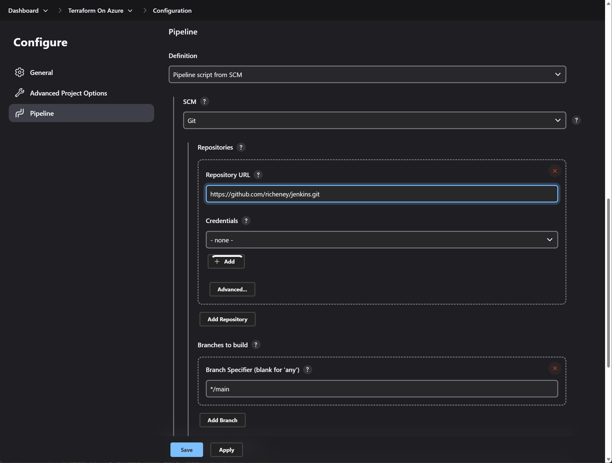
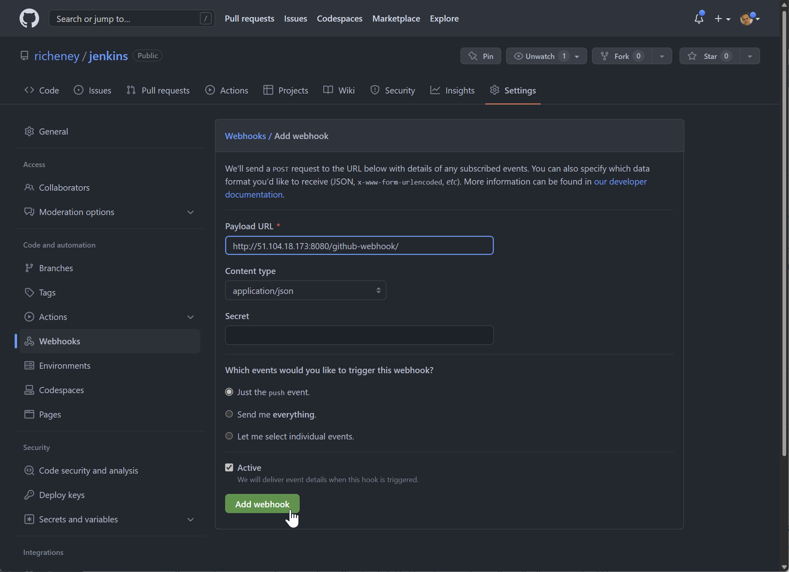
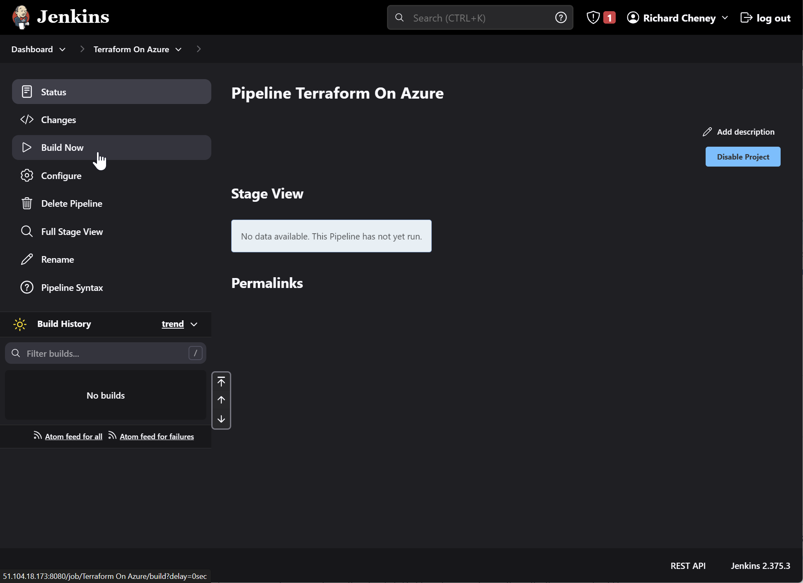
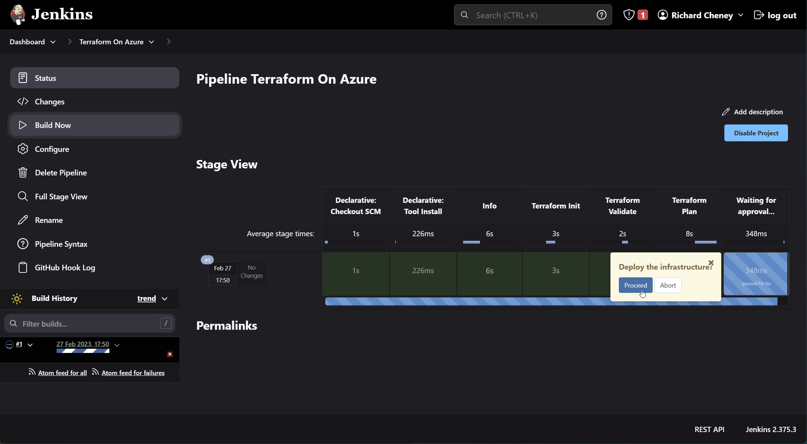
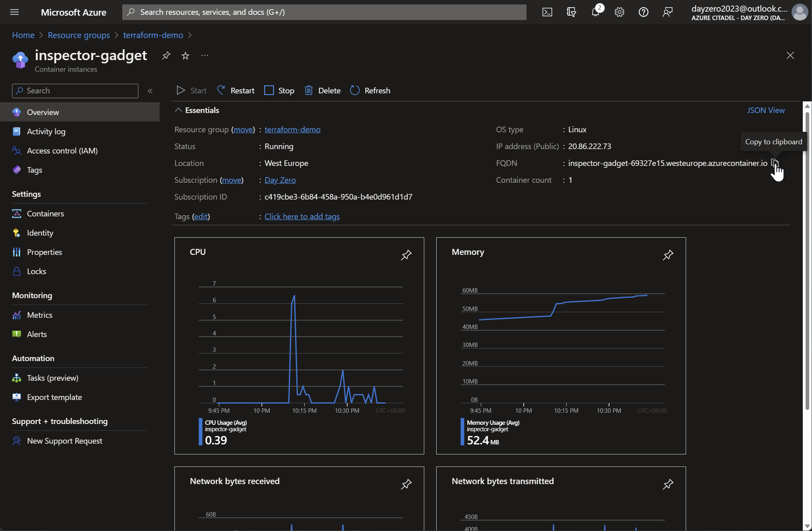

# Jenkins on Azure VM deploying Terraform config

Jenkins is a popular CI/CD tool. This example shows the creation of a Jenkins server with a service principal and both Azure CLI and Terraform installed.

Assumes a Bash environment with the [Azure CLI](https://learn.microsoft.com/cli/azure/install-azure-cli), plus access to a valid subscription.

The terraform config should create a resource group, *terraform-demo*, and an Azure Container Instance running the inspector gadget image, but this is purely to prove that your Terraform configuration can be deployed via Jenkins using a GitHub repo and an Azure Service Principal.

## Deploy a Jenkins server

1. Create cloud-config.yaml

    Create a cloud-config.yaml file with the following contents.

    ```yaml
    #cloud-config
    package_upgrade: true
    runcmd:
      - sudo apt install openjdk-11-jre ca-certificates curl apt-transport-https lsb-release gnupg gpg wget -y
      - wget -qO - https://pkg.jenkins.io/debian-stable/jenkins.io.key | sudo apt-key add -
      - wget -qO- https://apt.releases.hashicorp.com/gpg | gpg --dearmor | sudo tee /usr/share/keyrings/hashicorp-archive-keyring.gpg > /dev/null
      - wget -qO- https://packages.microsoft.com/keys/microsoft.asc | gpg --dearmor | sudo tee /usr/share/keyrings/microsoft.gpg > /dev/null
      - sh -c 'echo deb https://pkg.jenkins.io/debian-stable binary/ > /etc/apt/sources.list.d/jenkins.list'
      - sh -c 'echo "deb [arch=`dpkg --print-architecture` signed-by=/usr/share/keyrings/hashicorp-archive-keyring.gpg] https://apt.releases.hashicorp.com `lsb_release -cs` main" | sudo tee /etc/apt/sources.list.d/hashicorp.list'
      - sh -c 'echo "deb [arch=`dpkg --print-architecture` signed-by=/usr/share/keyrings/microsoft.gpg] https://packages.microsoft.com/repos/azure-cli/ `lsb_release -cs` main" | sudo tee /etc/apt/sources.list.d/azure-cli.list'
      - sudo chmod go+r /usr/share/keyrings/hashicorp-archive-keyring.gpg /usr/share/keyrings/microsoft.gpg
      - sudo apt-get update && sudo apt-get install jenkins terraform azure-cli jq -y
      - sudo service jenkins restart
    ```

    The cloud-config.yaml file will install

    * jenkins
    * terraform
    * azure-cli
    * jq

1. Set your default region and resource group

    Set these to your preferred values.

    ```bash
    az config set defaults.location=uksouth defaults.group=jenkins
    ```

    Setting defaults removes the need to specify `--location` and `--resource-group` on Azure CLI commands. Defaults are stored in `~/.azure/config`. Use `az config unset defaults.location defaults.group` to unset.

    See <https://learn.microsoft.com/cli/azure/azure-cli-configuration> for more.

1. Create the resource group

    ```bash
    az group create --name $(az config get defaults.group --query value -otsv)
    ```

1. Create the VM

    ```bash
    az vm create --name jenkins \
    --image UbuntuLTS \
    --admin-username "azureuser" \
    --generate-ssh-keys \
    --public-ip-sku Standard \
    --custom-data cloud-init-jenkins-terraform-azurecli.txt \
    --assign-identity [system]
    ```

1. Open port 8080 and 8443 on the NSG

    ```bash
    az vm open-port --port 8080 --priority 1010 --name jenkins
    az vm open-port --port 8443 --priority 1020 --name jenkins
    ```

## SSH to your Jenkins server

1. Grab the public IP address

    ```bash
    publicIp=$(az vm show --name jenkins  --show-details --query publicIps --output tsv)
    echo $publicIp
    ```

1. SSH onto the Jenkins server

    ```bash
    ssh azureuser@$publicIp
    ```

## Initial server config

1. Checks

    ```bash
    terraform --version
    az version
    service jenkins status
    ```

1. Display the Jenkins URL and unlock password

    ```bash
    publicIp=$(curl -sSL -H Metadata:true --noproxy "*" http://169.254.169.254/metadata/loadbalancer?api-version=2020-10-01 \
      | jq -r .loadbalancer.publicIpAddresses[0].frontendIpAddress)
    pwdfile=/var/lib/jenkins/secrets/initialAdminPassword
    echo "Open http://${publicIp}:8080"
    sudo --user=jenkins -- test -s $pwdfile && echo "and paste in $(sudo cat $pwdfile)"
    ```

## Initial UI connection

1. Connect to the URL and paste in the initialAdminPassword

1. Select initial plugins to install

    * GitHub

1. Create First Admin User

   * username
   * password
   * full name
   * email address

1. Save & Finish
1. Start using Jenkins

## Configure Jenkins Plugins

1. Manage Jenkins | System Configuration | Manage Plugins

    1. Click on *Available plugins*
    1. Search on the following plug-ins in turn
        * AnsiColor
        * Azure Credentials
        * Terraform
        * Azure Key Vault (optional)
        * Dark Theme (optional)

    1. Check and *Install without restart*

1. Restart Jenkins

    Once they have all installed then restart Jenkins:

    * Browse to `http://<ip_address>:8080/restart`, or
    * Run `sudo service jenkins restart`

## Dark mode (optional)

If you installed the Dark Theme plugin:

1. Manage Jenkins | Configure System
1. Scroll down to *Themes*
1. Select your preferred theme

## Jenkins Tools

Jenkins can install tools (binaries, etc) on the fly with automatic installers. We installed Terraform via apt and will use the `/usr/bin/terraform` binary.

1. Manage Jenkins | Global Tool Configuration
1. Scroll down to the Terraform section
1. *Add Terraform*
    1. Name = **terraform**

        For information, the name must match the second field in the Jenkinsfile tools block:

        ```go
        tools {
            'org.jenkinsci.plugins.terraform.TerraformInstallation' 'terraform'
        }
        ```

    1. Install directory = **/usr/bin**
    1. Uncheck *Install automatically*

        
1. Save

## Credential

1. Create a service principal

    ```bash
    az ad sp create-for-rbac --name http://jenkins_terraform_sp --output jsonc
    ```

1. Get the service principal's object ID

    ```bash
    objectId=$(az ad sp list --filter "displayname eq 'http://jenkins_terraform_sp'" --query [0].id -otsv)
    ```

1. Create Owner RBAC role assignment on the subscription

    ```bash
    subscriptionId=/subscriptions/$(az account show --query id -otsv)
    az role assignment create --assignee $objectId --role "Contributor" --scope $subscriptionId
    ```

1. Display the subscription ID

    ```bash
    az account show --query id --output tsv
    ```

1. Recreate the service principal

    This will patch it, resetting the password.

    ```bash
    az ad sp create-for-rbac --name http://jenkins_terraform_sp --output jsonc
    ```

1. Manage Jenkins | Manage Credentials
1. Click on *System*
1. Click on *Global credentials*
1. *+ Add Credentials*
    * Kind = **Azure Service Principal**
    * **Subscription ID**
    * **Client ID** (appId)
    * **Client Secret** (password)
    * **Tenant ID**
    * Id = **jenkins_terraform_sp**
    * Description = **ht<span>tp://</span>jenkins_terraform_sp**
1. *Verify Service Principal*

    

    If there are any issues then try to authenticate using `az login --service-principal`.

1. *Create*

## Remote state

1. Create a storage account and container for the Terraform remote state

    ```bash
    rgId=$(az group show --name $(az config get defaults.group --query value -otsv) --query id -otsv)
    sa=terraform$(md5sum <<< $rgId | cut -c1-12)
    az storage account create --name $sa --sku Standard_LRS --allow-blob-public-access false
    az storage container create --name "tfstate" --account-name $sa --auth-mode login
    ```

    Uses md5sum to generate a predictable hash from the resource group's resource ID.

1. Add Storage Blob Data Contributor RBAC role assignment

    ```bash
    saId=$(az storage account show --name $sa --query id -otsv)
    az role assignment create --assignee $objectId --role "Storage Blob Data Contributor" --scope $saId
    ```

1. Display resource group name and storage account name

    ```bash
    az storage account show --name $sa --query "{resource_group:resourceGroup, storage_account:name}" --output yaml
    ```

1. Manage Jenkins | Manage Credentials
1. *System*, *Global credentials*, *+ Add Credentials*
1. Kind = **Secret text**

    Create two credentials, for **resource_group** and **storage_account**.

    

    These will be used later by `terraform init` for the backend.

## Configure a pipeline

### Create the Jenkins pipeline

On the Jenkins dashboard:

1. *+ New Item+
1. Select *Pipeline"
1. Enter an item name

    

1. Click OK

    You will now be in the *Configure | General* screen for your pipeline.

1. Scroll down to Build Triggers section
1. Check *GitHub hook trigger for GITScm polling*

    

1. Scroll down further, to the Pipeline section
1. Change the *Definition* dropdown to *Pipeline script from SCM*

    

1. *SCM* should be set to *Git*
1. In repository URL, add in the .git path to your repo
1. Click on *Add Branch*
1. Set the specifier, e.g. `*/main`

    

    Note that there is a Jenkinsfile at the root of the repo, matching the default Script Path on the configuration.

1. Save

## Create the GitHub webhook

In your clone of this [GitHub repo](https://github.com/richeney/jenkins):

1. Settings | Webhooks
1. Set the *Payload URL* to `http://<ip_address>:8080/github-webhook/`
1. Set *Content type* to *application/json*

    

1. Click on *Add webhook*

## Trigger the initial test build

In Jenkins dashboard:

1. Select your pipeline
1. Click on *Build Now*

    

    The pipeline view will start to show in the right hand pane.

1. Approve the deployment

    Assuming the Terraform Init, Terraform Validate and Terraform Plan stages have succeeded, you will be asked to approve the deployment. Feel free to view the log output of the Terraform Plan stage.

    Hover over the *Waiting for approval* stage and you will get the option to *Proceed*.

    

    The final Terraform Apply stage should create the resource group and container instance.

    

    Success!

## Next

On the next page you will use the Azure CLI and the Cloud Shell to pull down an image into the container registry and you'll also create a virtual network.

## Resources

* <https://www.jenkins.io/doc/book/pipeline/jenkinsfile/>
* <https://plugins.jenkins.io/credentials/>
* <https://plugins.jenkins.io/azure-credentials/>
* <https://learn.microsoft.com/azure/developer/jenkins/configure-on-linux-vm>
* <https://learn.microsoft.com/azure/developer/jenkins/deploy-to-azure-spring-apps-using-azure-cli>
* <https://github.com/Azure-Samples/jenkins-terraform-azure-example/blob/main/Create_Jenkins_Job.md>
* <https://registry.terraform.io/providers/hashicorp/azurerm/latest/docs/guides/service_principal_client_secret>
* <https://learn.microsoft.com/en-us/azure/load-balancer/howto-load-balancer-imds?tabs=linux>
* <https://learn.microsoft.com/en-us/azure/virtual-machines/instance-metadata-service?tabs=linux>
* <https://www.cprime.com/resources/blog/how-to-integrate-jenkins-github/>

## Resources to be explored for hardening

Configure https:

* <https://drtailor.medium.com/how-to-set-up-https-for-jenkins-with-a-self-signed-certificate-on-ubuntu-20-04-2813ef2df537>

Configure secrets in Azure Key Vault:

* <https://github.com/Azure-Samples/jenkins-terraform-azure-example/blob/main/Create_Jenkins_Job.md>

OpenID Connect between AAD and Jenkins plugin:

* <https://plugins.jenkins.io/oidc-provider/>

    Documented for AWS and GCP - missing Azure.

Will also look at:

* Using credentials to access a private GitHub repo
* Removing the public IP and switching to Azure Bastion tunnels

## Resources dismissed

There is a lot of old information out there, and a number of plugins that are moving out of Microsoft support.

* <https://learn.microsoft.com/en-us/azure/developer/jenkins/plug-ins-for-azure>

Below is a list of resources that I explored and discounted as I believe that they are not on the recommended path, or they are now outdated. This includes anything to do with Jenkins and managed identity, which I don't believe is a working option. Very happy to be corrected!

* <https://plugins.jenkins.io/azure-cli/>
* <https://registry.terraform.io/providers/hashicorp/azurerm/latest/docs/guides/managed_service_identity>
* <https://github.com/Azure-Samples/azure-voting-app-redis>
* <https://www.genja.co.uk/blog/installing-jenkins-and-securing-the-traffic-with-tls-ssl/>
* <https://github.com/smertan/jenkins>
