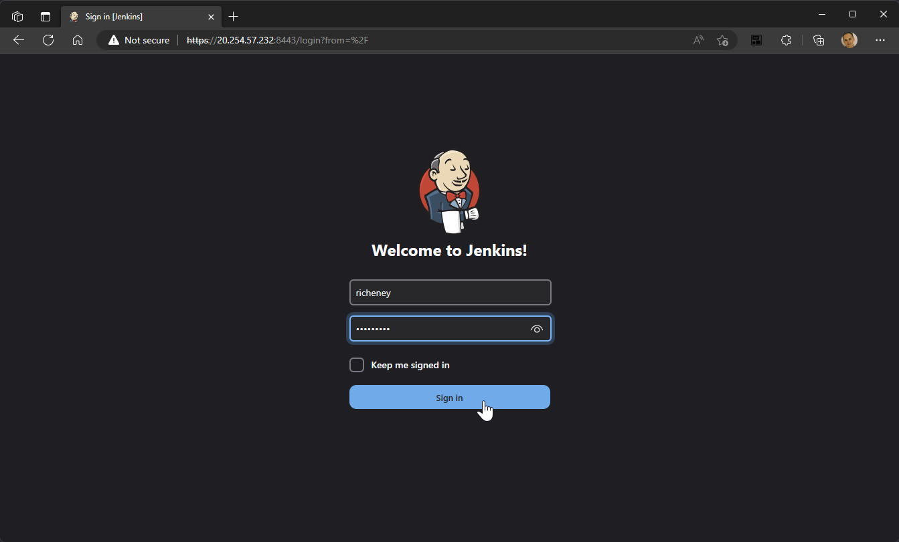
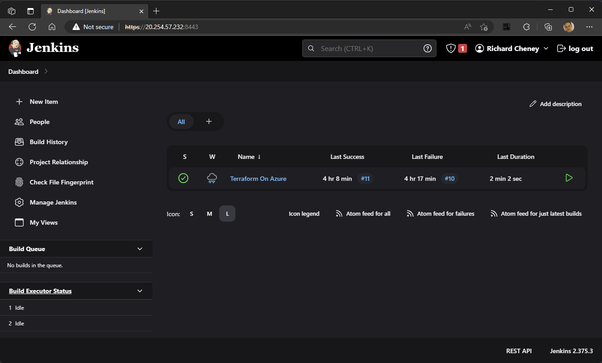

# Configuring HTTPS

Based on [Pritesh Tailor's blog post](https://drtailor.medium.com/how-to-set-up-https-for-jenkins-with-a-self-signed-certificate-on-ubuntu-20-04-2813ef2df537) and [Baeldung's blog post](https://www.baeldung.com/ops/jenkins-enable-https), updated for [systemd for more recent Jenkins versions](https://www.jenkins.io/doc/book/system-administration/systemd-services/).

1. Define a password to be used by the p12 certificate and keystore

    ```bash
    export COMPLEX_PASSWORD=myComplexPassword
    ```

1. Generate the key, certificates and Jenkins keystore as the jenkins user

    ```bash
    sudo --user=jenkins --preserve-env --set-home --shell -- << EOF
    openssl rand -writerand /var/lib/jenkins/.rnd
    [[ -d /var/lib/jenkins/.ssl ]] || mkdir /var/lib/jenkins/.ssl
    cd /var/lib/jenkins/.ssl
    openssl req -x509 -newkey rsa:4096 -keyout key.pem -out certificate.pem -sha256 -days 365 -nodes \
      -subj "/C=UK/ST=Berkshire/L=Reading/O=Azure Citadel/CN=azurecitadel.com"
    openssl pkcs12 -inkey key.pem -in certificate.pem -export -passout pass:$COMPLEX_PASSWORD -out certificate.p12
    keytool -importkeystore \
      -srckeystore /var/lib/jenkins/.ssl/certificate.p12 -srcstoretype pkcs12 -srcstorepass $COMPLEX_PASSWORD \
      -destkeystore /var/lib/jenkins/jenkinsserver.jks -deststoretype pkcs12 -deststorepass $COMPLEX_PASSWORD
    EOF
    ```

1. Modify jenkins systemd

    This creates /etc/systemd/system/jenkins.service.d/override.conf.

    ```bash
    sudo --preserve-env --shell -- << EOF
    SYSTEMD_EDITOR=tee systemctl edit jenkins <<OVERRIDE
    [Service]
    Environment="JENKINS_HTTPS_PORT=8443"
    Environment="JENKINS_HTTPS_KEYSTORE=/var/lib/jenkins/jenkinsserver.jks"
    Environment="JENKINS_HTTPS_KEYSTORE_PASSWORD=$COMPLEX_PASSWORD"
    OVERRIDE
    EOF
    ```

1. Reload the systemd daemon and restart the service

    ```bash
    sudo systemctl daemon-reload
    sudo systemctl restart jenkins
    ```

1. Open Jenkins

    Access over SSL on `https:<ip_address>:8443`.

    You will be prompted to accept the risk as the certificate is unsigned.

1. Update the Jenkins location

    1. Manage Jenkins | Configure System
    1. Scroll down to Jenkins Location
    1. Change from
        * `http://<ip_address>:8080/` to
        * `https://<ip_address>:8443/`

1. Success

    

    

1. Closing off HTTP

    * `sudo systemctl edit jenkins`
    * Add `Environment="JENKINS_PORT=-1"`
    * `sudo systemctl daemon-reload`
    * `sudo systemctl restart jenkins`
